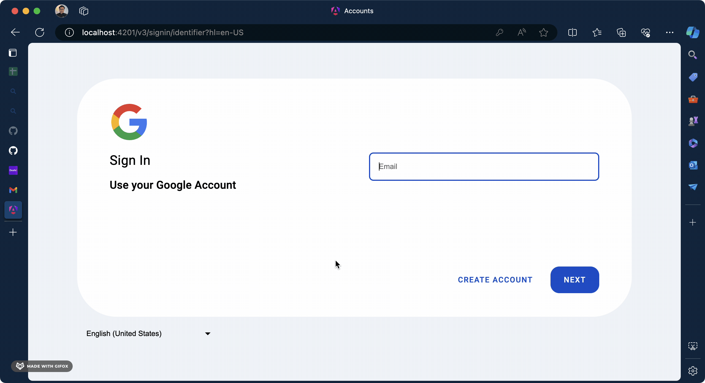

# What it's look like?

1. Layout Feature
   

2. Clean Architecture Overview
   

3. Language Feature
   

# What is this repository for?

An example of how to share session between domain and subdomain. For example,

1. accounts.example.com
2. example.com
3. service1.com

# Table of contents

- [Onboarding](./docs/onboarding.md)
- [How to create new app](./docs/how-to-create-new-app.md)
- [How to reuse layout between 2 paths](./docs/how-to-reuse-layout-between-2-paths.md)
- [How to create an use case](./docs/how-to-create-an-use-case.md)
- [How to translate](./docs/how-to-translate.md)
