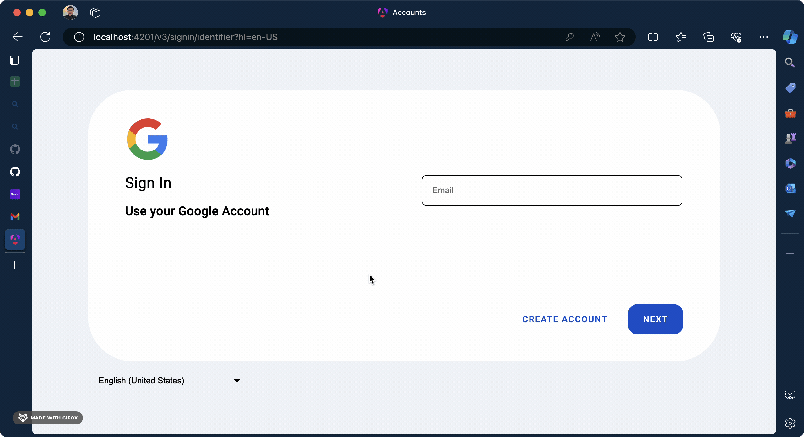

# What it's look like



# Condition

There are 2 paths which use the same layout.

1. `/v3/signin/identifier`
2. `/v3/signin/challenge/pwd`

# Note

1. Angular is smart enough to not download the same Layout twice. So, importing a Layout in 2 Pages is ok.

# How to

1. Create a Layout file.

   `accounts.layout.html`

   ```
   <div class="overlay" [class.overlay-show]="showOverlay"></div>

   <div class="main">
     
     <div class="section">
       <div class="left-content">
         <span class="com-headline-5">{{ title }}</span>
         <span class="com-headline-6">{{ description }}</span>
       </div>
       <div class="right-content">
         <ng-content select="[right-content-input]" />

         <div class="actions">
           <ng-content select="[right-content-action]" />
         </div>
       </div>
     </div>
   </div>
   ```

2. use the Layout in the Page.

   `sign-in-identifier.page.html`

   ```
   <acc-accounts
     title="Sign In"
     description="Use your Google Account"
     [showOverlay]="isLoading"
   >
     <com-input-text
       #inputEmail
       placeholder="Email"
       [(value)]="email"
       [errorMessage]="errorMessage"
       right-content-input
     />

     @if (isCreateAccountEnabled) {
       <com-button-basic (buttonClick)="onCreateAccount()" right-content-action
         >Create account</com-button-basic
       >
     }

     @if (isChallengePwdEnabled) {
       <com-button-flat
         (buttonClick)="onNext()"
         [disabled]="isLoading"
         right-content-action
         >Next</com-button-flat
       >
     }
   </acc-accounts>
   ```

   `challenge-pwd.page.html`

   ```
   <acc-accounts title="Welcome"></acc-accounts>
   ```
